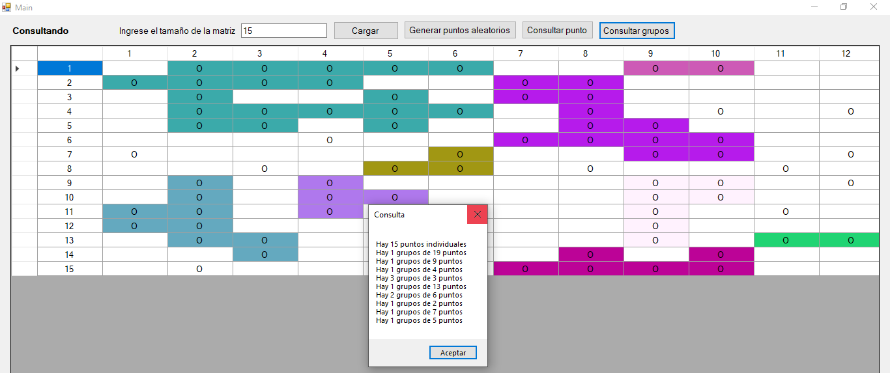
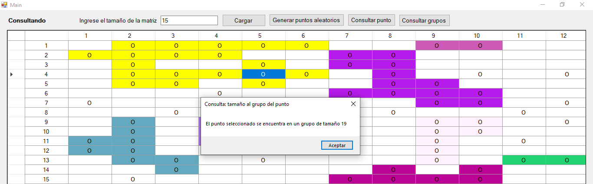

# Proyecto3Leng

## Versiones:
* SWI Prolog 6.6.1 (32 bits)
* SwiPlCs 1.1.60301.0 (32 bits)
* .NET Framework 4.7.2

## Acerca de:
Realizar consultas a prolog desde C#: 
* Guardar un punto (assert).
* Eliminar un punto (retract).
* Eliminar todos los puntos (retractall).
* Consultar el grupo de puntos dado un punto. 
* Consultar todos los grupos de puntos.

Curso: Lenguajes de programación.
II Semestre 2020.
Profesor: Oscar Víquez Acuña.